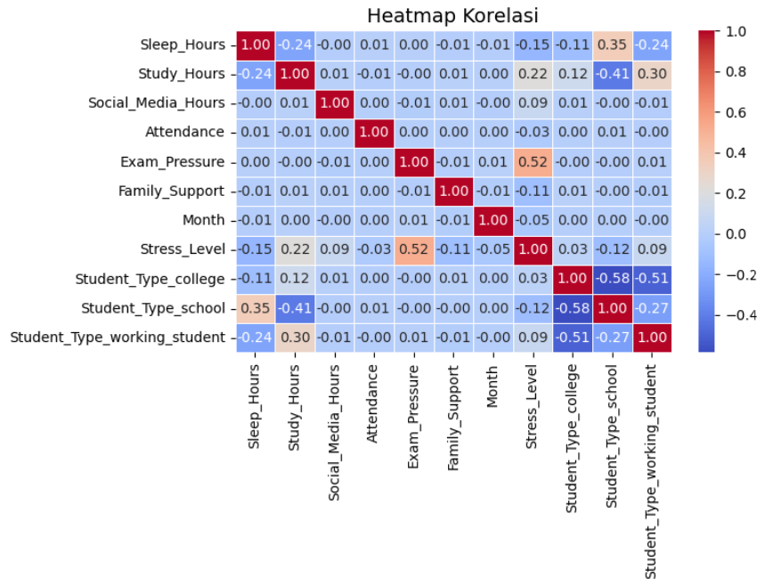
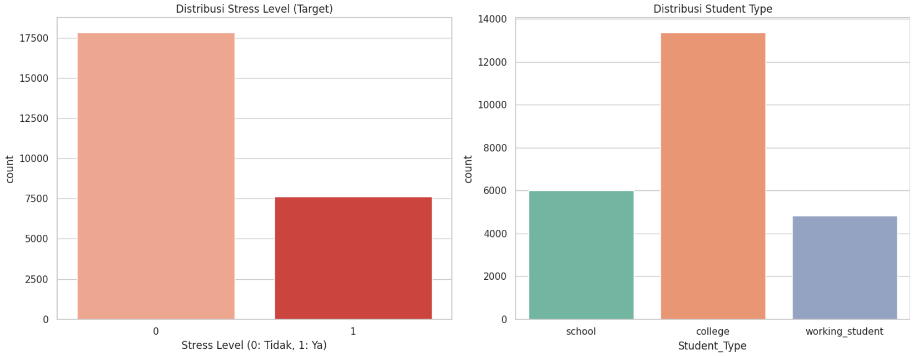
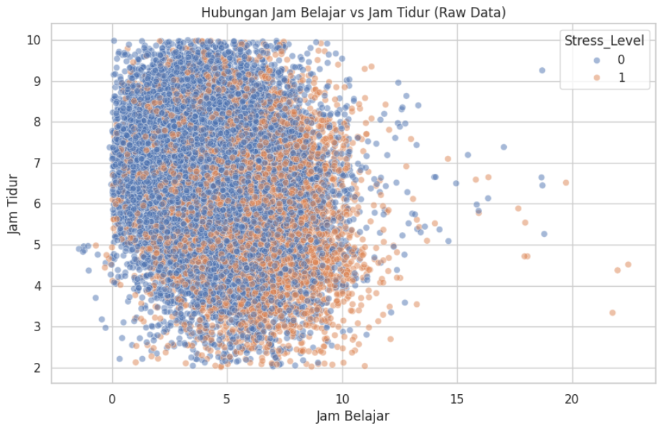
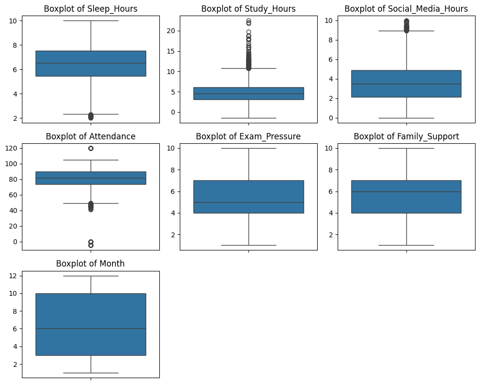
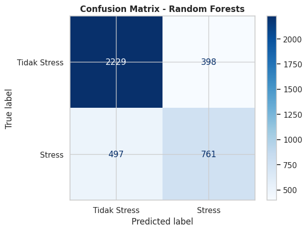
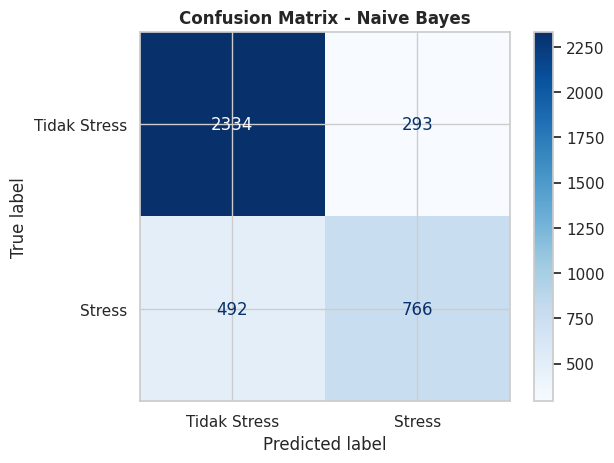
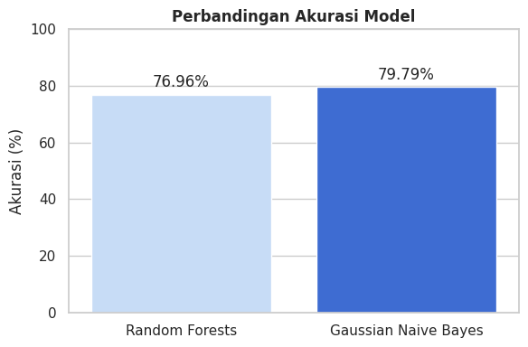

# **Prediksi Stress Mahasiswa**

## **🖇️ Project Overview**

Tekanan akademis merupakan salah satu pemicu utama masalah kesehatan mental di kalangan pelajar. Selain tekanan akademis, terdapat beberapa faktor lain yang mempengaruhi kondisi mental pelajar, seperti jam tidur, waktu terpapar oleh screen time, dukungan keluarga, dan lain sebagainya. Proyek ini bertujuan untuk **mendeteksi adanya indikasi stress pada mahasiswa** menggunakan algoritma **Random Forests, dan Naive Bayes** dengan dataset dari Kaggle.

👩🏻‍💻 **Manfaat Proyek:**

✔️ Meningkatkan kesadaran diri (Self-Awareness) mahasiswa untuk mengetahui apakah pola hidup, jam belajar, dan beban saat ini sudah masuk ke dalam zona bahaya terindikasi stress.

✔️ Mahasiswa dapat memanajemen waktu lebih baik.

✔️ Optimalisasi layanan konseling, dosen pembimbing akademik atau unit konseling kampus dapat memprioritaskan mahasiswa yang membutuhkan bantuan psikologis secara tepat sasaran dengan adanya sistem deteksi indikasi stress ini.

---

## **📄 Business Understanding**

✒️ **Problem Statements**

1. Apa faktor yang paling mempengaruhi adanya indikasi stress pada mahasiswa?
2. Bagaimana machine learning dapat mendeteksi adanya indikasi stress pada mahasiswa?
3. Bagaimana performa model Random Forests dan Naive Bayes dalam klasifikasi indikasi stress pada mahasiswa?

🎯 **Goals**

✔️ Mengetahui faktor yang paling mempengaruhi adanya indikasi stress pada mahasiswa.

✔️ Mengembangkan sistem klasifikasi indikasi mahasiswa menggunakan machine learning.

✔️ Menguji performa model supervised learning, algoritma Random Forests dan Naive Bayes.

---

## 🔍 **Data Understanding**

Dataset bersumber dari [Kaggle](https://www.kaggle.com/datasets/sridevilavanyacse/student-lifestyle-and-stress-prediction-dataset).

Terdapat **25.500 baris data** dan **sembilan kolom**.


### ▶️ **Install and Import Libraries**

```python
import numpy as np
import matplotlib.pyplot as plt
import pandas as pd
import seaborn as sns
from sklearn.preprocessing import LabelEncoder
from sklearn.model_selection import train_test_split
from sklearn.preprocessing import LabelEncoder
from sklearn.metrics import accuracy_score, classification_report, confusion_matrix, ConfusionMatrixDisplay
from sklearn.ensemble import RandomForestClassifier
from sklearn.naive_bayes import GaussianNB
import kagglehub
import os
```

### ▶️ **Load Dataset from Kaggle**

```python
path = kagglehub.dataset_download("sridevilavanyacse/student-lifestyle-and-stress-prediction-dataset")

print("Path to dataset files:", path)
print("Isi folder:", os.listdir(path))

file_name = "student-lifestyle-and-stress-dataset.csv"
full_path = os.path.join(path, file_name)

data = pd.read_csv(full_path)
df = data.copy()
```

---

### ▶️ Lihat Jumlah Baris Dan Kolom

```python
df.shape
```

🤔 Berikut adalah penjelasan untuk setiap kolom dalam dataset:

| Kolom | Deskripsi |
|---|---|
| **Student_Type** | Menunjukkan kategori siswa (variabel kategorikal) |
| **Sleep_Hours** | Jumlah jam tidur siswa |
| **Study_Hours** | Jumlah jam belajar siswa |
| **Social_Media_Hours** | Jumlah jam siswa menghabiskan waktu di media sosial |
| **Attendance** | Persentase kehadiran siswa |
| **Exam_Pressure** | Tingkat tekanan yang dirasakan siswa terkait ujian |
| **Family_Support** | Tingkat dukungan keluarga yang dirasakan siswa |
| **Month** | Bulan saat data dikumpulkan atau relevan |
| **Stress_Level** | Tingkat stres siswa — target variabel, biner (0 = tidak stres, 1 = stres) |

### ▶️ Lihat Data Kolom

```python
df.info()

df_stress = df.groupby('Stress_Level')['Stress_Level'].count().reset_index(name='Tingkat Stress')
df_stress

df_type = df.groupby('Student_Type')['Student_Type'].count().reset_index(name='Student Total')
df_type
```

### 😖 Kondisi Data

- Saat ini ada **24 data duplikat**
- Banyak baris yang memiliki *missing values*
- Terdapat *Outlier* dengan mahasiswa yang jam tidurnya lebih kecil dari 3 jam

### ▶️ Lihat Kondisi Data

```python
print("=== 🔴 KONDISI SEBELUM PEMBERSIHAN (RAW DATA) ===")
print(f"Total Baris: {len(data)}")
print(f"Jumlah Duplikat: {data.duplicated().sum()}")
print("\nJumlah Missing Values per Kolom:")
print(data.isnull().sum())

print("\nStatistik Deskriptif:")
display(data.describe())
```

---

## 📊 **Eksplorasi Data Mentah (EDA - Pre-Cleaning)**

Sebelum melakukan pembersihan, mari kita bedah bagaimana rupa data ini sebenarnya. Memahami data mentah membantu kita memvalidasi apakah proses pembersihan nantinya benar-benar diperlukan.

### ▶️ Melihat Korelasi Antar Fitur dengan Heatmap

```python
df_encoded = pd.get_dummies(df, columns=['Student_Type'], dtype=int)

corr = df_encoded.corr(numeric_only=True)

plt.figure(figsize=(10, 12))
sns.heatmap(corr, annot=True, cmap='coolwarm', fmt=".2f", linewidths=0.5)
plt.title("Heatmap Korelasi", fontsize=14)
plt.tight_layout()
plt.show()
```



```python
print('Nilai mendekati +1 = hubungan positif kuat')
print('Nilai mendekati 0 = tidak ada hubungan')
print('Nilai mendekati -1 = hubungan negatif kuat')
```

### 🔍 Penjelasan Heatmap

Rentang nilai korelasi dengan kekuatan hubungan didasarkan pada:

| Rentang Nilai | Kekuatan Hubungan |
|---|---|
| 0.00 – 0.19 | Sangat Lemah |
| 0.20 – 0.39 | Lemah |
| 0.40 – 0.59 | Sedang |
| 0.60 – 0.79 | Kuat |
| 0.80 – 1.00 | Sangat Kuat |

Analisis korelasi antar fitur dengan indikasi stress:

1. **Sleep_Hours (-0.14)** — Korelasi negatif sangat lemah; bertambahnya jam tidur cenderung menurunkan indikasi stress, tetapi efeknya tidak signifikan.
2. **Study_Hours (0.21)** — Korelasi positif lemah; bertambahnya jam belajar meningkatkan indikasi stress, tetapi efeknya kurang signifikan.
3. **Social_Media_Hours (0.09)** — Korelasi positif sangat lemah; bertambahnya jam scroll sosmed cenderung menaikkan indikasi stress, tetapi efeknya tidak signifikan.
4. **Attendance (-0.03)** — Korelasi negatif sangat lemah; banyaknya persentase kehadiran cenderung menurunkan indikasi stress, tetapi efeknya tidak signifikan.
5. **Exam_Pressure (0.51)** — Korelasi positif sedang; bertambahnya tekanan ujian menaikkan indikasi stress.
6. **Family_Support (-0.10)** — Korelasi negatif sangat lemah; bertambahnya dukungan keluarga dapat menurunkan indikasi stress.
7. **Month (-0.05)** — Korelasi negatif sangat lemah.

### ▶️ Melihat Distribusi Data

```python
sns.set_theme(style='whitegrid')
fig, axes = plt.subplots(1, 2, figsize=(15, 6))

sns.countplot(data=data, x='Stress_Level', ax=axes[0], hue='Stress_Level', palette='Reds', legend=False)
axes[0].set_title('Distribusi Stress Level (Target)')
axes[0].set_xlabel('Stress Level (0: Tidak, 1: Ya)')

sns.countplot(data=data, x='Student_Type', ax=axes[1], hue='Student_Type', palette='Set2', legend=False)
axes[1].set_title('Distribusi Student Type')

plt.tight_layout()
plt.show()
```



### 🔍 Wawasan Utama Data Mentah

- **Imbalance Target**: Jumlah mahasiswa yang *tidak stress* jauh lebih banyak dibandingkan yang *stress*. Ini penting untuk diperhatikan saat melatih model machine learning nanti.
- **Data Bolong (Missing)**: Grafik di atas belum mencerminkan total populasi 25.500 karena banyaknya nilai NaN.
- **Pola Belajar vs Tidur**: Perlu dilihat bagaimana sebaran jam belajar dan jam tidur sebelum dibersihkan (termasuk outlier).

### ▶️ Melihat Sebaran Jam Tidur dan Jam Belajar

```python
plt.figure(figsize=(10, 6))
sns.scatterplot(data=data, x='Study_Hours', y='Sleep_Hours', hue='Stress_Level', alpha=0.5)
plt.title('Hubungan Jam Belajar vs Jam Tidur (Raw Data)')
plt.xlabel('Jam Belajar')
plt.ylabel('Jam Tidur')
plt.show()
```



---

## 🖊 **Data Preparation**

Dalam *data preparation*, kita akan menghapus data duplikat, membenarkan data dengan *missing values*, dan data *Outlier*.

### 👓 Mencari *Outlier*

Untuk mendeteksi *outlier*, kita memvisualisasikan distribusi data menggunakan *boxplot* untuk kolom numerik.

### ▶️ Mencari Data *Outlier*

```python
numerical_cols = ['Sleep_Hours', 'Study_Hours', 'Social_Media_Hours', 'Attendance', 'Exam_Pressure', 'Family_Support', 'Month']

plt.figure(figsize=(15, 10))
for i, col in enumerate(numerical_cols):
    plt.subplot(3, 3, i + 1)
    sns.boxplot(y=df[col])
    plt.title(f'Boxplot of {col}')
    plt.ylabel('')
plt.tight_layout()
plt.show()
```



### ▶️ Menghapus Data Duplikat

```python
df.drop_duplicates(inplace=True)
print(f"Jumlah data setelah menghapus duplikat: {len(df)}")
```

### ▶️ Memperbaiki *Missing Values*

Kolom numerik diisi dengan nilai **median**, kolom kategori diisi dengan **modus**.

```python
for col in numerical_cols:
    if df[col].isnull().any():
        median_val = df[col].median()
        df[col].fillna(median_val, inplace=True)

if df['Student_Type'].isnull().any():
    mode_val = df['Student_Type'].mode()[0]
    df['Student_Type'].fillna(mode_val, inplace=True)

print("\nJumlah missing values setelah imputasi:")
print(df.isnull().sum())
```

### ▶️ **Menangani Outlier**

Kita akan menghapus baris data di mana nilai-nilai numerik (seperti jam tidur, jam belajar, dll.) berada di bawah 0, karena nilai-nilai negatif pada konteks ini dianggap sebagai *outlier* yang tidak valid.

```python
initial_rows = len(df)

for col in numerical_cols:
    if (df[col] < 0).any():
        df = df[df[col] >= 0]
        print(f"Removed rows with {col} < 0. Current rows: {len(df)}")

print(f"\nJumlah baris setelah menghapus outlier: {len(df)}")
print(f"Total baris outlier yang dihapus: {initial_rows - len(df)}")
```

---

## **🔍 Hasil Quality Check Data**

### 1. 📝 Missing Values (Data Hilang)
- **Status:** 🛠️ *Fixed!*
- **Temuan Awal:** Terdapat sekitar ~1.300 data kosong di hampir setiap kolom.
- **Tindakan:** Kolom numerik diisi dengan **Median**, kolom kategori diisi dengan **Modus**.
- **Hasil Akhir:** 0 Missing Values! ✅

### 2. 👥 Data Duplikat
- **Status:** 🧹 *Cleaned!*
- **Temuan:** Terdeteksi **24 baris** data yang identik.
- **Tindakan:** Seluruh baris duplikat dihapus.
- **Hasil Akhir:** Dataset bersih dari data ganda! ✨

### 3. 📈 Outliers (Data Pencilan)
- **Status:** ⚠️ *Identified*
- **Temuan:**
  - 😴 **Sleep Hours**: Ada siswa yang tidur kurang dari 3 jam!
  - 📚 **Study Hours**: Ditemukan siswa yang belajar lebih dari 15–20 jam!
  - 📱 **Social Media**: Ada yang menghabiskan waktu >9 jam sehari.
  - 🏫 **Attendance**: Ada data kehadiran yang sangat rendah (0–40%).
- **Catatan:** Outlier dipertahankan sementara karena mungkin mencerminkan kondisi riil mahasiswa yang ekstrem.

---

## **📊 Laporan Perbandingan Kualitas Data**

```python
print("=== 🟢 KONDISI SESUDAH PEMBERSIHAN (CLEANED DATA) ===")
print(f"Total Baris: {len(df)}")
print(f"Jumlah Duplikat: {df.duplicated().sum()}")
print("\nJumlah Missing Values per Kolom:")
print(df.isnull().sum())

print("\nStatistik Deskriptif:")
display(df.describe())
```

### ▶️ Drop Baris dengan Student_Type = 'school'

```python
df = df[df['Student_Type'] != 'school']

df_type = df.groupby('Student_Type')['Student_Type'].count().reset_index(name='Student Total')
df_type
```

### ▶️ Membulatkan Angka Jam

```python
df['Sleep_Hours'] = df['Sleep_Hours'].round(0).astype(int)
df['Study_Hours'] = df['Study_Hours'].round(0).astype(int)
df['Social_Media_Hours'] = df['Social_Media_Hours'].round(0).astype(int)
df['Exam_Pressure'] = df['Exam_Pressure'].round(0).astype(int)
df['Family_Support'] = df['Family_Support'].round(0).astype(int)
```

### ▶️ Label Encoding untuk Student Type

```python
le = LabelEncoder()
df['Student_Type_Encoded'] = le.fit_transform(df['Student_Type'])

print('Hasil Encoding Student Type')  # 0 = College, 1 = Working_Student
print(df[['Student_Type', 'Student_Type_Encoded']])
print(df['Student_Type_Encoded'].value_counts())
```

### ▶️ Menentukan Kolom Input (X) dan Target (y)

```python
X = df[['Student_Type_Encoded', 'Sleep_Hours', 'Study_Hours', 'Social_Media_Hours', 'Exam_Pressure', 'Family_Support']]
y = df['Stress_Level']

print('Kolom INPUT (X):')
print(X.head(3))
print()
print('Kolom TARGET (Y):')
print(y.head(3).to_string())
```

### ▶️ Training dan Testing

```python
X_train, X_test, y_train, y_test = train_test_split(
    X, y,
    test_size=0.2,
    random_state=42
)

print(f'Data Training : {len(X_train)} baris <- untuk melatih model')
print(f'Data Testing  : {len(X_test)} baris <- untuk menguji model')
```

### 📝 Ringkasan Perubahan

1. **Baris Data**: Berkurang dari **25.500** menjadi **25.476** karena penghapusan duplikat.
2. **Missing Values**: Berhasil dibersihkan dari ~1.300 menjadi **0 (Nol)**.
3. **Drop Baris**: Drop baris `Student_Type = 'school'`, sehingga sisa data menjadi **19.464** baris.
4. **Integritas Data**: Nilai rata-rata dan distribusi kini lebih akurat untuk pemodelan.
5. **Pembulatan Angka**: Kolom jam dan skala dibulatkan menggunakan `round()`.
6. **Label Encoding**: `Student_Type` diubah menjadi integer (0 = College, 1 = Working_Student).

---

## **Modelling**

```python
# Model Random Forests
model_rf = RandomForestClassifier(n_estimators=100, random_state=42)
model_rf.fit(X_train, y_train)

# Model Naive Bayes
model_nb = GaussianNB()
model_nb.fit(X_train, y_train)

print('Model selesai dilatih!')
```

---

## **Model Evaluation**

```python
target_name = ['Tidak Stress', 'Stress']

y_pred_rf = model_rf.predict(X_test)
accuracy_rf = accuracy_score(y_test, y_pred_rf)
classification_rep_rf = classification_report(y_test, y_pred_rf, target_names=target_name)

y_pred_nb = model_nb.predict(X_test)
accuracy_nb = accuracy_score(y_test, y_pred_nb)
classification_rep_nb = classification_report(y_test, y_pred_nb, target_names=target_name)

print(f"Model Random Forests Accuracy: {accuracy_rf*100:.2f}%")
print("\nClassification Report Random Forests:\n", classification_rep_rf)
print(f"Model Gaussian Naive Bayes Accuracy: {accuracy_nb*100:.2f}%")
print("\nClassification Report Naive Bayes:\n", classification_rep_nb)
```

### Contoh Hasil Prediksi vs Jawaban Asli

```python
## Random Forests
contoh_rf = X_test.copy().reset_index(drop=True)
contoh_rf['Indikasi Stress Asli']    = [target_name[l] for l in y_test.values]
contoh_rf['Indikasi Stress Prediksi'] = [target_name[l] for l in y_pred_rf]
contoh_rf['Benar?'] = ['✅' if a == p else '❌' for a, p in zip(y_test.values, y_pred_rf)]

contoh_nb = X_test.copy().reset_index(drop=True)
contoh_nb['Indikasi Stress Asli']    = [target_name[l] for l in y_test.values]
contoh_nb['Indikasi Stress Prediksi'] = [target_name[l] for l in y_pred_nb]
contoh_nb['Benar?'] = ['✅' if a == p else '❌' for a, p in zip(y_test.values, y_pred_nb)]

print('10 Contoh Hasil Prediksi Random Forests:')
print(contoh_rf[['Indikasi Stress Asli', 'Indikasi Stress Prediksi', 'Benar?']].head(10).to_string())

print('\n10 Contoh Hasil Prediksi Naive Bayes:')
print(contoh_nb[['Indikasi Stress Asli', 'Indikasi Stress Prediksi', 'Benar?']].head(10).to_string())
```

### Confusion Matrix — Random Forests

```python
cm_rf = confusion_matrix(y_test, y_pred_rf)

plt.figure(figsize=(6, 5))
disp = ConfusionMatrixDisplay(confusion_matrix=cm_rf, display_labels=['Tidak Stress', 'Stress'])
disp.plot(cmap='Blues', values_format='d')
plt.title('Confusion Matrix - Random Forests', fontsize=12, fontweight='bold')
plt.show()
```



### Confusion Matrix — Naive Bayes

```python
cm_nb = confusion_matrix(y_test, y_pred_nb)

plt.figure(figsize=(6, 5))
disp = ConfusionMatrixDisplay(confusion_matrix=cm_nb, display_labels=['Tidak Stress', 'Stress'])
disp.plot(cmap='Blues', values_format='d')
plt.title('Confusion Matrix - Naive Bayes', fontsize=12, fontweight='bold')
plt.show()
```



---

## **Deployment**

Deployment model dapa dilihat pada link di bawah ini:

https://huggingface.co/spaces/arbinnn/student_stress

---
## **Analisis Ketidakseimbangan Data**

Kedua model memiliki performa yang jauh lebih baik dalam memprediksi kelas 'Tidak Stress' (contohnya F1-score 0.86 pada Naive Bayes) dibandingkan kelas 'Stress' (F1-score: 0.66 pada Naive Bayes). Hal ini dipengaruhi oleh jumlah sampel data training kelas 'Tidak Stress' yang dua kali lipat lebih banyak daripada kelas 'Stress' (support 2627 vs 1258). Efeknya, model lebih kaya akan informasi mengenai karakteristik mahasiswa yang tidak stres.

---

## **Precision vs Recall**

| Metrik | Random Forests | Naive Bayes |
|---|---|---|
| **Precision Kelas Stress** | 0.66 | 0.72 |
| **Recall Kelas Stress** | 0.60 | 0.61 |

- **Precision Random Forests (0.66)**: Dari semua mahasiswa yang diprediksi stres, 66% memang terindikasi stres.
- **Precision Naive Bayes (0.72)**: Dari semua mahasiswa yang diprediksi stres, 72% memang terindikasi stres.
- **Recall Random Forests (0.60)**: Dari total mahasiswa yang aslinya stres, model berhasil mendeteksi 60% (40% tidak terdeteksi).
- **Recall Naive Bayes (0.61)**: Dari total mahasiswa yang aslinya stres, model berhasil mendeteksi 61% (39% tidak terdeteksi).

---

## **Kesimpulan**

Berdasarkan pemodelan yang telah dilakukan, model **Gaussian Naive Bayes** menunjukkan performa yang lebih unggul dengan akurasi **79.79%**, dibandingkan dengan model **Random Forests** yang menghasilkan akurasi **76.96%**. Keunggulan Naive Bayes mengindikasikan bahwa fitur-fitur indikator gaya hidup mahasiswa cenderung berdistribusi independen secara kondisional terhadap variabel target indikasi stress.

```python
models = ['Random Forests', 'Gaussian Naive Bayes']
accuracies = [accuracy_rf * 100, accuracy_nb * 100]

plt.figure(figsize=(6, 4))
ax = sns.barplot(x=models, y=accuracies, palette=['#bfdbfe', '#2563eb'])

for bars in ax.containers:
    ax.bar_label(bars, fmt='%.2f%%', label_type='edge', padding=3)

plt.ylim(0, 100)
plt.title('Perbandingan Akurasi Model', fontsize=12, fontweight='bold')
plt.ylabel('Akurasi (%)')
plt.tight_layout()
plt.show()
```



---
